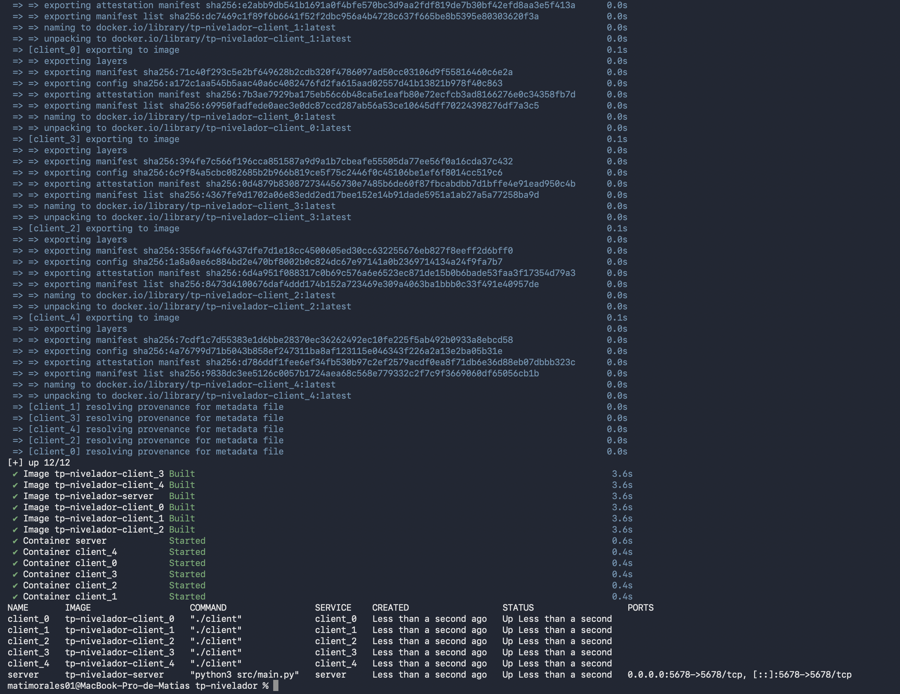
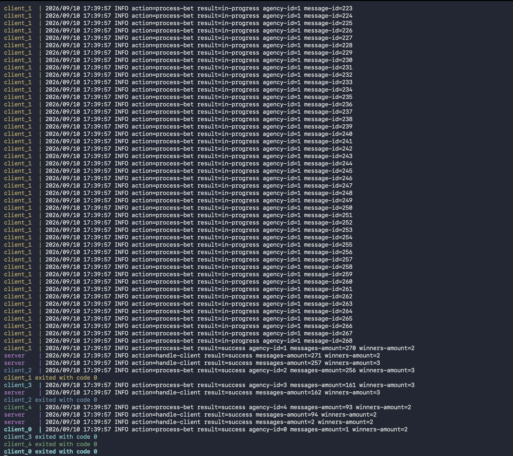
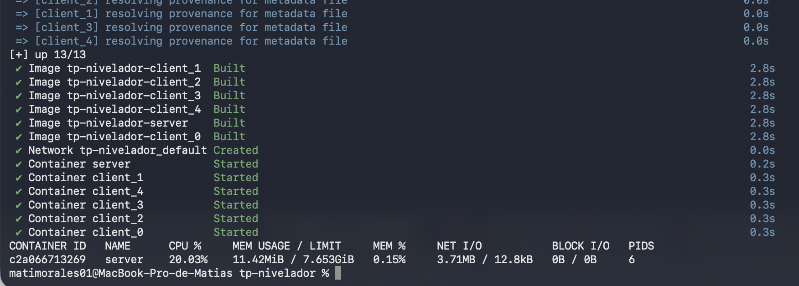
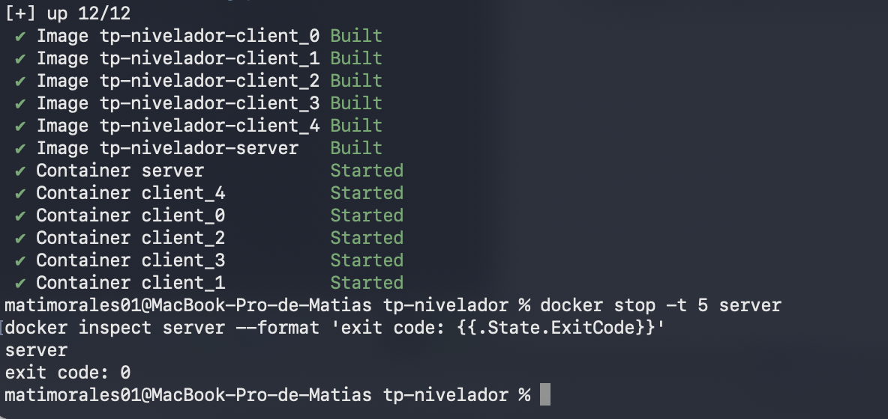

# Informe

## Docker

El sistema levanta 5 agencias (clientes) y un servidor, cada uno en su propio container, definidos en `docker-compose.yaml`. Cada cliente tiene su propio `AGENCY_ID` para poder identificarlo en los logs. El puerto del servidor está expuesto al host para poder probarlo con `netcat` mientras se desarrolla.

El archivo de apuestas de entrada de cada agencia (`INPUT_FILE`) y el de salida con los resultados (`OUTPUT_FILE`) se montan como volúmenes en vez de copiarse adentro de la imagen (`./input` de solo lectura, `./output` para escribir), así cambiar los datos de entrada no obliga a reconstruir nada.

### Ejemplo

```bash
make up
docker compose ps
```



## Protocolo de comunicación

Cada mensaje que viaja entre cliente y servidor empieza con 5 bytes fijos: el primero dice qué tipo de mensaje es, y los otros 4 dicen cuánto mide el resto del mensaje. Con esos 5 bytes el que recibe ya sabe exactamente cuántos bytes más tiene que leer, sin necesidad de separadores ni de esperar a que todo llegue junto en un solo `recv`/`read`.

Hay 3 tipos de mensaje:

- `BET`: manda una o varias apuestas juntas. Cada apuesta va como texto separado por comas (`agency_id,nombre,apellido,documento,nacimiento,numero`), y si van varias juntas se separan entre sí con un salto de línea. No usamos JSON ni ninguna librería de serialización (está prohibido en la consigna), el armado y el parseo del texto es manual.
- `FINISH`: lo manda el cliente cuando ya terminó de mandar todas sus apuestas, no lleva contenido.
- `WINNERS`: la respuesta del servidor con los documentos de los ganadores de esa agencia en particular, separados por coma.

Por ejemplo, una apuesta de la agencia 0 se ve así en bytes:

```
[ 01 ][ 00 00 00 30 ][ 0,Santiago Lionel,Lorca,30904465,1999-03-17,7574 ]
  |          |                          |
 tipo      largo                     payload
(BET)   (48 en hex, 0x30)          (48 bytes)
```

Un `FINISH` no lleva payload, entonces el largo es 0:

```
[ 02 ][ 00 00 00 00 ]
  |          |
 tipo      largo
(FINISH)    (0)
```

Y una respuesta con dos ganadores:

```
[ 03 ][ 00 00 00 11 ][ 30904465,21689196 ]
  |          |                |
 tipo      largo           payload
(WINNERS) (17 en hex, 0x11)  (2 DNI separados por coma)
```

La cantidad de apuestas que se mandan juntas en un mismo mensaje `BET` es configurable con la variable `BATCH_SIZE`. El cliente va juntando líneas del archivo de entrada hasta llegar a esa cantidad y recién ahí arma el mensaje y lo manda (si sobran algunas al final del archivo, se mandan igual aunque no lleguen a completar el tamaño).

Para evitar los problemas típicos de sockets (mandar o recibir menos bytes de los que uno pidió en una sola llamada) armamos `send_all` y `recv_all` de los dos lados: en vez de confiar en que un solo `send`/`recv` (o `Write`/`Read` en Go) mueve todo, se repite la llamada en un loop hasta completar la cantidad de bytes esperada, y si la conexión se corta en el medio se corta también el loop con un error en vez de devolver datos incompletos.

Para no acumular las apuestas en memoria, el archivo de entrada se lee dos veces en modo streaming: una para ir armando y mandando los batches, y otra (rebobinando el archivo) al final, para filtrar y escribir solo las líneas ganadoras en el `OUTPUT_FILE`.

### Ejemplo

```bash
make down && make up
make logs
```



## Sincronización

El servidor atiende cada conexión en un thread aparte, así puede recibir y procesar apuestas de varias agencias en simultáneo. El archivo de apuestas y el conjunto de agencias que ya terminaron de mandar están protegidos por un `threading.Condition` compartido, que sirve tanto para que no se pisen dos threads escribiendo a la vez como para bloquear un thread hasta que se cumpla una condición.

Cuando llega el mensaje `FINISH` de un cliente, ese thread anota su agencia como terminada, avisa a los demás threads que puedan estar esperando (`notify_all`) y se queda bloqueado (`condition.wait()`) hasta que la cantidad de agencias terminadas llegue al mínimo configurado en `AGENCY_QUORUM_MIN`. Recién ahí calcula los ganadores de esa agencia puntual y le contesta solo a ella — no se manda la lista completa a todo el mundo, cada una se entera nada más que de sus propios ganadores.

Ese mismo lock protege que no se mezclen las escrituras cuando llegan apuestas de distintas agencias al mismo tiempo.

### Ejemplo

Con `AGENCY_QUORUM_MIN` en un valor más alto que la cantidad de clientes, quedan todos bloqueados esperando y se puede ver la columna `PIDS` > 1:

```bash
make up
docker stats --no-stream server
```



## Cierre prolijo (SIGTERM)

Cliente y servidor manejan la señal SIGTERM en vez de dejar que el sistema operativo los mate de golpe:

- El servidor, al recibir la señal, marca que se está cerrando, despierta a todos los threads que puedan estar bloqueados esperando el quorum (para que no se queden colgados para siempre) y cierra el socket que escucha conexiones nuevas, lo que hace que el loop principal salga solo.
- El cliente (Go) tiene una goroutine escuchando la señal aparte del resto del programa. Apenas la recibe, cierra la conexión activa — eso hace que cualquier lectura o escritura que esté bloqueada en ese momento falle al instante en vez de quedarse esperando, y el programa corta con código de salida 0 (no es un error, es un cierre pedido).

Así el tiempo de cierre queda acotado y no depende de esperar algo que capaz nunca iba a terminar solo.

### Ejemplo

```bash
make up
docker stop -t 5 server
docker inspect server --format 'exit code: {{.State.ExitCode}}'
```



## Instrucciones para correr

* Levantar el sistema completo (server + 5 agencias):

```bash
make up
```

* Ver los logs de todo:

```bash
make logs
```

* Bajar todo:

```bash
make down
```

* Correr los tests automáticos:

```bash
make test
```

* Generar el `docker-compose.yaml` con otra cantidad de clientes (opcional, no es necesario para correr el TP tal cual está):

```bash
./scripts/generate_compose.sh <cantidad_de_clientes>
```

## Aclaraciones

Tengo Mac, y al correr el TP me fallaban algunas pruebas. Investigando llegué a estas conclusiones:

- **El archivo de salida a veces no se creaba.** Cuando levantaba los 5 clientes juntos, alguno fallaba porque no encontraba la carpeta compartida con la máquina todavía, como si el container arrancara un poquito antes de que Docker terminara de conectar esa carpeta. Por eso decidí que el programa abra ese archivo más tarde, recién cuando ya tiene los resultados para escribir, en vez de abrirlo apenas arranca. Así le doy tiempo de sobra a que la carpeta esté lista.

- **El test de batching a veces fallaba.** Este test mide el tamaño de los paquetes de red que manda el cliente. En mi máquina esa medición me daba resultados raros, y llegué a la conclusión de que es por cómo Docker maneja la red puertas adentro en Mac (usa una especie de máquina virtual por debajo), algo que no tiene que ver con mi código. Probé el mismo test varias veces y el resultado cambiaba cada vez, lo cual confirma que es un tema de mi entorno y no un bug real.
